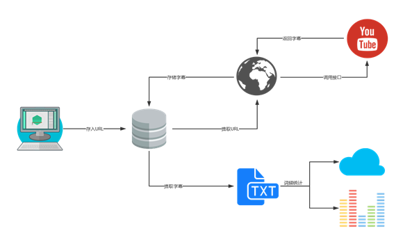
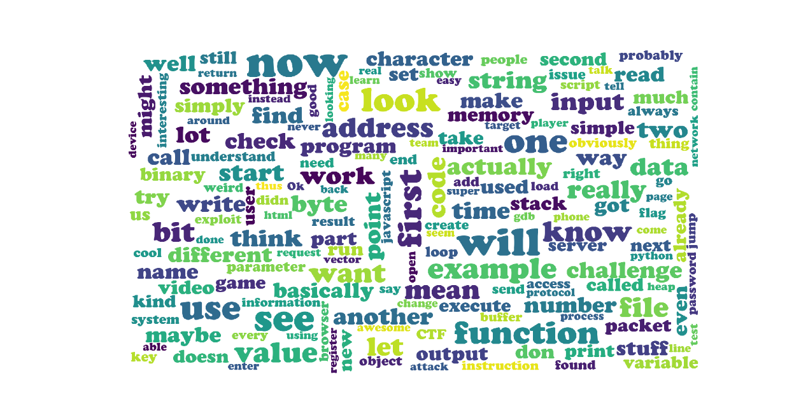
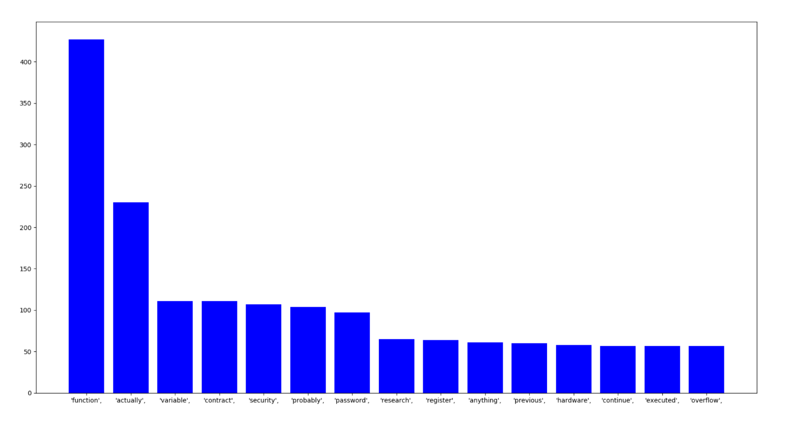

# YoutubeCaptionCrawler

##Introduce

This software is written by Yao and Deng to participate The Software Development Competition of MJU.

It crawl the captions on nitrxgen.net for YouTube API forbids to download vedio captions if you're not its owner now.

It can crawl captions and store in your database and then analyze which words are important.

##Environment

MongoDB Server([Download](https://www.mongodb.com/download-center/community?tdsourcetag=s_pctim_aiomsg))

Python3.x([Download](https://www.python.org/downloads/))

Python Dependence:

- Matplotlib
- Numpy
- Pymongo
- Pyparsing
- Requests
- Wordcloud
- Argparse

  

## Usage

**HELP:**python YoutubeCaptionDownloader.py -h

**Insert URL into DATABASE:**

1) python YoutubeCaptionDownloader.py -i -u URL

2) python YoutubeCaptionDownloader.py -i -t FileContainURL

**Download Captions according to URL(In Database):** python YoutubeCaptionDownloader.py -d 

**Export Captions into a File(caption.txt):** python YoutubeCaptionDownloader.py -e

**Draw WordCloud according to The Caption  File(caption.txt):** python YoutubeCaptionDownloader.py -w

**Draw Histogram according to The Caption  File(caption.txt):** python YoutubeCaptionDownloader.py -p

​      

## Result

 1)WordCloud

 

2)Histogram

   

